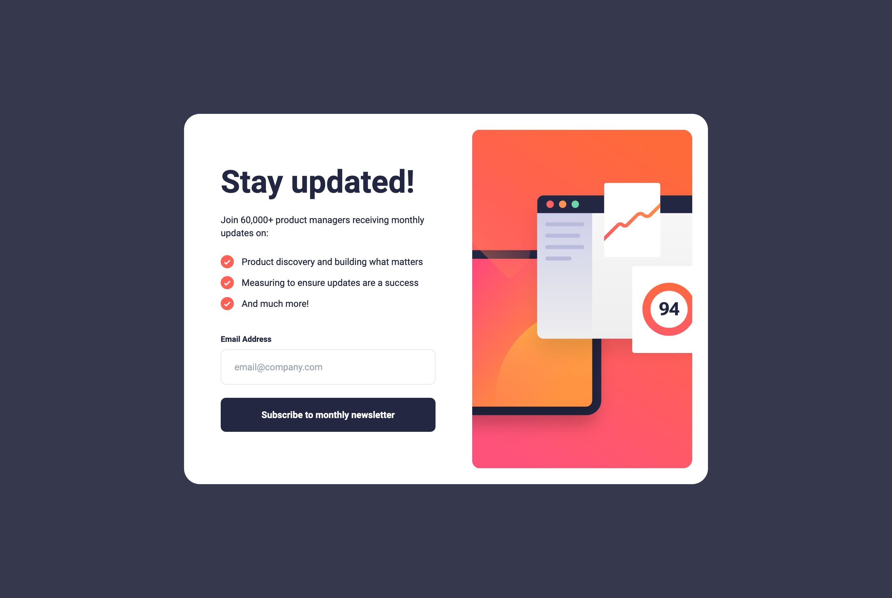

# Frontend Mentor - Newsletter sign-up form with success message solution

This is a solution to the [Newsletter sign-up form with success message challenge on Frontend Mentor](https://www.frontendmentor.io/challenges/newsletter-signup-form-with-success-message-3FC1AZbNrv).

## Table of contents

- [Overview](#overview)
  - [The challenge](#the-challenge)
  - [Screenshot](#screenshot)
  - [Links](#links)
  - [Built with](#built-with)

## Overview

### The challenge

Users should be able to:

- Add their email and submit the form
- See a success message with their email after successfully submitting the form
- See form validation messages if:
  - The field is left empty
  - The email address is not formatted correctly
- View the optimal layout for the interface depending on their device's screen size
- See hover and focus states for all interactive elements on the page

### Screenshot

### Links

- Solution URL: [https://www.frontendmentor.io/challenges/newsletter-signup-form-with-success-message-3FC1AZbNrv/](https://www.frontendmentor.io/challenges/newsletter-signup-form-with-success-message-3FC1AZbNrv/)
- Live Site URL: [https://jamesa14.github.io/fm--newsletter-sign-up/](https://jamesa14.github.io/fm--newsletter-sign-up/)

### Built with

- HTML5
- Tailwind CSS
- JavaScript
